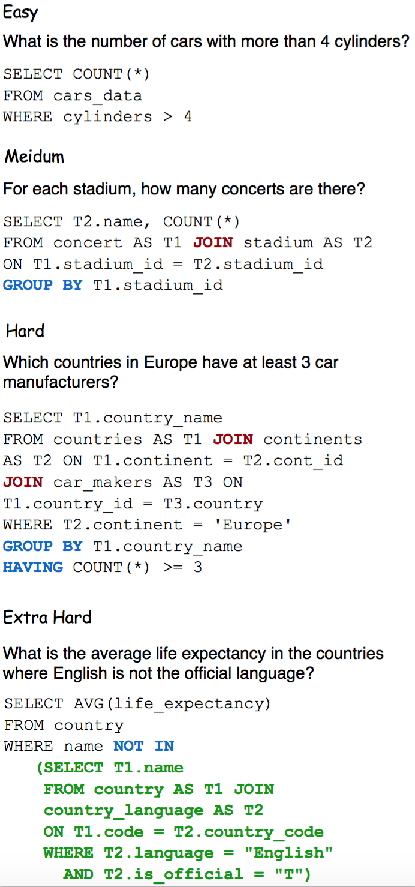
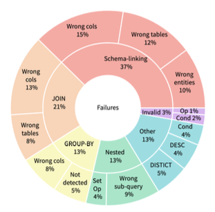

# Text-to-SQL Evaluation Metrics 

Text-to-SQL is a widely studied problem in natural language processing, with many clear real world applications. Within the literature, [Spider](https://arxiv.org/abs/1809.08887) has come to be the default text-to-SQL dataset. Naturally, the Yale Semantic Parsing and Text-to-SQL Challenge (YSP) has come to be the standard benchmark for text-to-SQL models, defining the State-of-the-Art (SOTA). However, the YSP challenge is not without its flaws, namely the lack of execution accuracies within its benchmarking. Currently, YSP utilizes [Test Suite Accuracy](https://arxiv.org/abs/2010.02840) as its official evaluation metric for Spider, SParC, and CoSQL. While Test Suite Accuracy is a useful metric for evaluating the quality of a model's inferences, it does not provide a clear picture of the model's ability to execute the inferences it makes. Below, we provide a brief overview of the metrics used for evaluating the performance of LLMs on text-to-SQL tasks.

## Metrics

### Execution Accuracy

Execution Accuracy is the percentage of query inferences that have denotations matching that of the gold's denotation. This metric is the most important metric for evaluating the performance of a text-to-SQL model, as it provides a clear picture of the model's ability to produce inferences that fufill the task at hand. However, execution accuracy is not without its faults. As outlined in the [Test Suite Accuracy](https://arxiv.org/abs/2010.02840) paper, "Single denotation evaluation is too loose, as the denotations of g and q might be different on another database w". Other potential issues with execution accuracy include:

- Pragmatically Acceptable, Semantically Wrong: The model returns the correct result, but includes additional information that is not returned by the gold query.
- Semantically Acceptable, Pragmatically Wrong: The model returns the correct result, but ignores a more granular request made by the user (greater than instead of greater than or equal to).
- Database Dependent: The model returns a result that is correct for a given database, but incorrect for another database (both the gold and the predicted return null for a given dataset due to poor data generation).

### Test Suite Accuracy

Test Suite Accuracy involves evaluating a predicted SQL query against a set of test cases (a "test suite") to determine if the predicted query is semantically equivalent to the ground truth query. Instead of relying solely on exact string matches or denotation matches on a single database, Test Suite Accuracy evaluates the predicted query against multiple "neighboring" databases and queries to capture its semantic essence. At its core, Test Suite Accuracy depends upon the creation of many "neighbor queries: a set of SQL queries that are close to the gold in surface forms but likely to be semantically different" that are then validated against a set of randomly generated databases selected for their ability to distinguish as many neighbor queries as possible. 

## Data Considerations

### Difficulty

Generally, the difficulty of a given datum is based on the number of SQL keywords used, presence of nested subqueries, and use of column selection and aggregation.

Taken from the YSP website, the difficulty of a given datum can be thought of through the following examples: 

## Error Evaluation

From the literature, [DIN-SQL](https://arxiv.org/abs/2304.11015) provides a useful framework for evaluating the errors made by a text-to-SQL model. DIN-SQL defines the following error types:

- Schema Linking: instances where the model failed to identify column names, table names, or entities mentioned in questions.
- JOIN: includes queries that needed a JOIN but the model was unable to identify all the tables required or the correct foreign keys to join the tables.
- GROUP BY: includes cases where the SQL state- ment required a GROUP BY clause, but the model either did not recognize the need for grouping or wrong columns were used for grouping the results.
- Queries with Nesting and Set Operations: the gold query used nesting or set operations but the model did not recognize the nested structure or was unable to detect the correct nesting or set operation.
- Invalid SQL: queries including syntax errors that cause their execution to fail.
- Miscellaneous: Examples included SQL queries that contained extra predicates, missed a predicate, or had missing or redundant DISTINCT or DESC keywords. 

A useful representation from their paper is found below:

